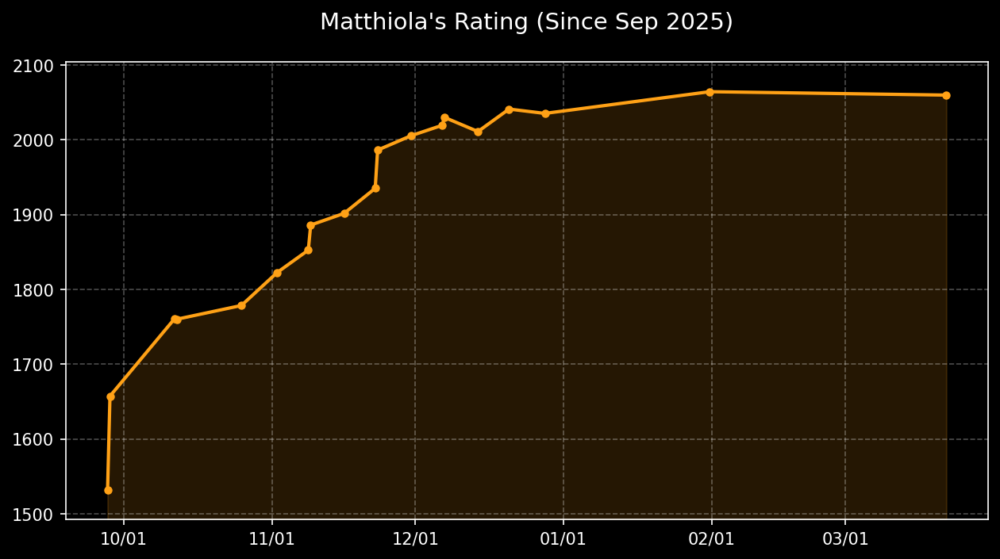

<!--## Hi there 👋

**matthiola0/matthiola0** is a ✨ _special_ ✨ repository because its `README.md` (this file) appears on your GitHub profile.

Here are some ideas to get you started:

- 🔭 I’m currently working on ...
- 🌱 I’m currently learning ...
- 👯 I’m looking to collaborate on ...
- 🤔 I’m looking for help with ...
- 💬 Ask me about ...
- 📫 How to reach me: ...
- 😄 Pronouns: ...
- ⚡ Fun fact: ...
-->

## Hi, I'm Boy 👋

<!--

  

-->
My name is Po-Yu Pan. You can call me Boy, as it sounds similar to my Chinese name.
* 🏫 Master of Science (M.S.) in Computer Science, Expected June 2027
    * National Cheng Kung University, Tainan, Taiwan
* 🏫 Bachelor of Science (B.S.) in Interdisciplinary Program of Science, 2025
    * National Tsing Hua University, Hsinchu, Taiwan
* 👤 Website: [Click Here !!!](https://matthiola.dev)
* 📫 How to reach me: You can email me by <matthiola020@gmail.com>

## 💻 Tech Stack

  <code></code>
  
  <code></code>
  
  <code></code>
  
  <code></code>
  
  <code></code>
  
  <code></code>
   
  <code></code>
  
  <code></code>
  
  <code></code>
  
  <code></code>
  
  <code></code>
  
  <code></code>

  <code></code>
  
  <code></code>
  
  <code></code>
  
  <code></code>
  
  <code></code>
  
  <code></code>
  
  <code></code>
  
  <code></code>
  
  <code></code>

<!-- ## 📈 Quant Research Portfolio

Seven self-contained repos covering classical factor research, ML
selection, alternative data, market microstructure, and derivatives
pricing & hedging — all on free / public data, all reproducible.
Honest write-ups (failure modes + costs included) live in each repo's
README.

| Repo | What it is | Headline result |
|---|---|---|
| **[qtools](https://github.com/matthiola0/qtools)** | Personal Python quant research toolkit — three-market price loaders, vectorised long-short backtest engine, factor & performance metrics. | Used as the shared backbone of every project below. **42 unit tests green.** |
| **[classic-factors](https://github.com/matthiola0/classic-factors)** | Cross-market study of 12-1 momentum and 1-week reversal on US S&P 500, Taiwan 0050, and top crypto pairs. | **TW reversal IC +0.083** (strongest of the 6 cells); US 12-1 momentum has **decayed to ~0 IC post-2015** — reproduces the published factor-crowding finding. |
| **[ml-cross-sectional](https://github.com/matthiola0/ml-cross-sectional)** | LightGBM / XGBoost cross-sectional ranker on S&P 500, walk-forward validated, with a sector / β-neutral v2. | **XGB net Sharpe 0.87** (raw) → **0.76** (sector-neutral, 41% return survival); **LGBM rises 0.70 → 0.85** after neutralisation as 2022 sector drag is removed. |
| **[alt-data-sentiment](https://github.com/matthiola0/alt-data-sentiment)** | Reddit (WSB / stocks / investing / options) FinBERT sentiment factor on S&P 500, 2021 single-regime study. | Pooled rank-IC vs 21d fwd **non-significant** (HAC \|t\| < 2). Cross-subreddit: r/investing **−3.47 t** (contrarian) — **but signal disappears once you control for momentum + reversal**. WSB bullish-spike event study gives +1.71% CAR(+10). |
| **btc-microstructure** *(private)* | C++20 + Python pipeline on Bybit linear `ob200` 100-ms order books. OBI signal → forward-mid-return → cost reality check. | **OBI_5 → 1s-fwd Pearson IC +0.204** on 2.68M bars (no OOS decay). Gross 0.26 bps/trade — **fee-net −10.76 bps after Bybit taker** = textbook "does this survive costs?" no. |
| **[ml-return-forecast](https://github.com/matthiola0/ml-return-forecast)** | Companion to ml-cross-sectional — same features, target switched to absolute fwd-21d return, with macro + β + sector exposures added. | `HistMean` baseline beats every learned model on **MAE** (target is fat-tailed); regression top-20 vs ranker top-20 month-end **Jaccard ≈ 0.19** — the two formulations really select different baskets. |
| **derivatives-lab** *(private)* | Hand-coded options stack on Deribit BTC: BS + 5 Greeks + Brent IV solver, MC + Kemna-Vorst CV, Heston FFT + calibration, Whalley-Wilmott Δ-hedging. | Heston FFT abs error **< 1e-8 vs QuantLib**; Asian + geometric CV **23.3× SE reduction**; calibrated Heston on real Deribit chain to ~5 vol pts; W-W Δ-hedging on 5,000 Heston paths = **textbook "W-W is not a free lunch"** — γ-band and cost regime determine the Sharpe-maximising region. **28 tests green.** |

> Private repos are available on request.
-->

## 🚀 My Algorithm Journey
<table align="center" style="border: none;">
  <tr>
    <td align="center" width="50%" style="border: none;">
      
    </td>
    <td align="center" width="50%" style="border: none;">
      
    </td>
  </tr>
</table>

## 📊 GitHub Analytics
<table style="border: none;">
  <tr>
    <td align="center" width="50%" style="border: none;">
      
    </td>
    <td align="center" width="50%" style="border: none;">
      
    </td>
  </tr>
</table>

## 🏆 GitHub Trophies

<!--
## My Snake

-->

<!--
##

  

-->
