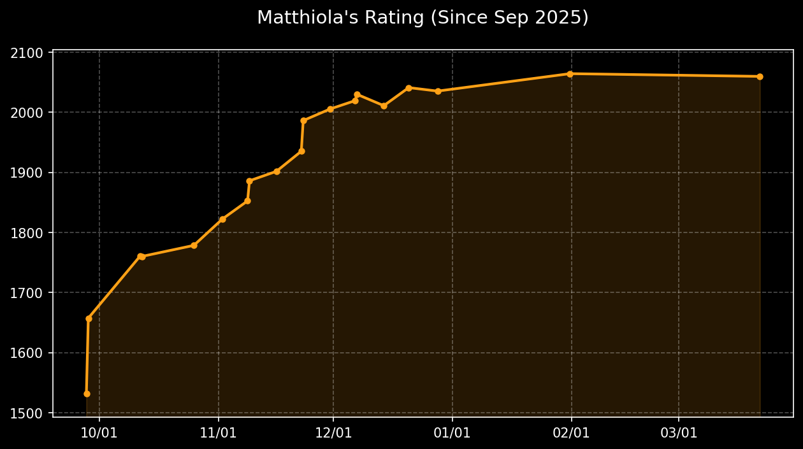

# Po-Yu Pan

## Hi, I'm Boy 👋

You can call me Boy, as it sounds similar to my Chinese name.

M.S. Computer Science candidate at National Cheng Kung University, focused on
systems and network software, concurrency, and performance engineering.
Open-source contributor to [Hummingbot](https://github.com/hummingbot/hummingbot).

* 🎓 Expected graduation: **August 2027** · Available to start: **September 2027**
* 👤 Website: [matthiola.dev](https://matthiola.dev)
* 📫 How to reach me: <matthiola020@gmail.com>

## 🏫 Education

* **M.S. in Computer Science** — National Cheng Kung University, Tainan, Taiwan
    * Expected Aug 2027
* **B.S. in Interdisciplinary Program of Science** — National Tsing Hua University, Hsinchu, Taiwan
    * 2025

## 🌱 Open Source Contributions

**[Hummingbot](https://github.com/hummingbot/hummingbot)** — upstream contributions

* ✅ **Merged — [#8338: Ensure candle requests always span at least one interval](https://github.com/hummingbot/hummingbot/pull/8338)**
  Fixed zero-width historical candle requests caused by `limit=0` on
  sub-interval ranges and pagination boundaries. Clamped each request to at
  least one candle interval, added boundary-candle deduplication, and
  introduced six regression tests. The complete candles test suite passed with
  1,263 tests.

🔍 <strong>Pull requests currently under review</strong>

 

* **Under review — [#8410: Prevent an XEMM maker-order race between the control loop and fill events](https://github.com/hummingbot/hummingbot/pull/8410)**
  Proposed a lifecycle-safe cancellation flow that keeps the tracked maker
  order until exchange confirmation, so stale asynchronous work cannot cancel
  an already-filled order or leave a fill unhedged.

* **Under review — [#8411: Prevent partial balance snapshots during Bybit Perpetual refresh](https://github.com/hummingbot/hummingbot/pull/8411)**
  Proposed constructing refreshed balances in local dictionaries and publishing
  the completed snapshot atomically, so concurrent readers see either the
  previous complete state or the new complete state.

* **Under review — [#8407: Ignore duplicate stop actions for terminated or shutting-down executors](https://github.com/hummingbot/hummingbot/pull/8407)**
  Proposed idempotent stop handling so repeated shutdown actions do not
  re-enter cleanup logic, raise state errors, or overwrite an executor's
  existing close reason.

## 🛠️ Selected Projects

* **[poker-hand-review](https://github.com/matthiola0/poker-hand-review)** — An
  offline hand-history analysis tool with a Python CLI, local Web UI, tolerant
  parser, decision-grading engine, pluggable solver interface, automated tests,
  and CI.
* **[qtools](https://github.com/matthiola0/qtools)** — A reusable Python
  research toolkit with unified US, Taiwan, and crypto data loaders, a
  vectorized backtest engine, cost models, factor/performance metrics, a CLI,
  and 42 unit tests.
* **[ml-cross-sectional](https://github.com/matthiola0/ml-cross-sectional)** — A
  walk-forward cross-sectional ML study using linear models, LightGBM, and
  XGBoost, with SHAP analysis, transaction-cost-aware backtesting, cross-market
  checks, and sector/beta neutralization.

## 🔬 Research Focus

Packet classification, traffic classification, and ML/RL-assisted network
systems, with an emphasis on latency, classifier selection, and reproducible
performance evaluation.

## 🎯 Technical Focus

* **Languages:** C++, Python
* **Systems:** Linux, networking, concurrency, performance benchmarking
* **Tools:** Git, Docker, GitHub Actions, CMake
* **ML:** PyTorch, scikit-learn

## 💻 Tech Stack

  <code></code>
  
  <code></code>
  
  <code></code>
  
  <code></code>
  
  <code></code>
  
  <code></code>
   
  <code></code>
  
  <code></code>
  
  <code></code>
  
  <code></code>
  
  <code></code>
  
  <code></code>

  <code></code>
  
  <code></code>
  
  <code></code>
  
  <code></code>
  
  <code></code>
  
  <code></code>
  
  <code></code>
  
  <code></code>
  
  <code></code>

## 🚀 My Algorithm Journey
<table align="center" style="border: none;">
  <tr>
    <td align="center" width="50%" style="border: none;">
      
    </td>
    <td align="center" width="50%" style="border: none;">
      
    </td>
  </tr>
</table>

## 📊 GitHub Analytics
<table style="border: none;">
  <tr>
    <td align="center" width="50%" style="border: none;">
      
    </td>
    <td align="center" width="50%" style="border: none;">
      
    </td>
  </tr>
</table>

## 🏆 GitHub Trophies

