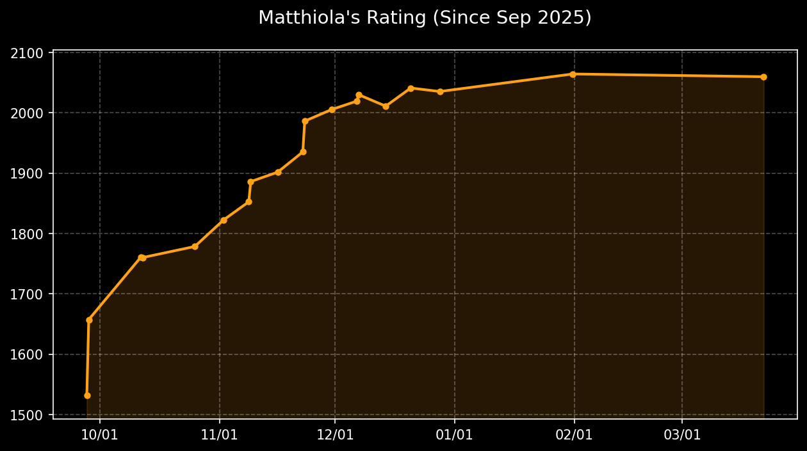

# Po-Yu Pan

## Hi, I'm Boy 👋

You can call me Boy, as it sounds similar to my Chinese name.

M.S. Computer Science student at National Cheng Kung University, researching
packet classification in CIAL (Computer & Internet Architecture Lab). Outside
the lab, I build backend and AI agent systems at hackathons and contribute to
open source.

* 🎓 Expected graduation: **August 2027** · Available to start: **September 2027**
* 👤 Website: [matthiola.dev](https://matthiola.dev)
* 📫 How to reach me: <matthiola020@gmail.com>

## 🏫 Education

* **M.S. in Computer Science** — National Cheng Kung University, Tainan, Taiwan
    * Expected Aug 2027
* **B.S. in Interdisciplinary Program of Sciences** — National Tsing Hua University, Hsinchu, Taiwan
    * 2025

## 🛠️ Hackathon Projects

* 🥉 **[First Aid Copilot](https://github.com/matthiola0/mchackathon)** — Third place, Google track, 2026 Hsinchu x Meichu Hackathon 
  Five of us built it in about 30 hours. I owned the rules and data side: a
  Python rule engine that chooses the first-aid steps, AED open-data ingestion
  with route estimates and automatic reassignment, and the PostgreSQL data layer.
* **[MAXi](https://github.com/demo-or-die/maxi)** — Finalist, AIWave: Taiwan Generative AI Applications Hackathon 
  I built the multi-agent war room, where six agents run concurrently on Amazon
  Bedrock and stream results over Server-Sent Events.
* **[BitoGuard](https://github.com/demo-or-die/Bitopro_Hackathon_web)** — Finalist, Agent for Truth: Disinformation Defense Hackathon 
  I built the FastAPI backend, the React and D3.js risk dashboard, and the AWS
  design around my teammates' LightGBM model.

## 🌱 Open Source Contributions

* ✅ **Merged — [sysprog21/codetrial#86: Add ordered Gemini credential failover](https://github.com/sysprog21/codetrial/pull/86)** 
  codetrial is a live technical-interview simulator written in Rust. I added an
  ordered list of Gemini API keys, so when a key is rejected or runs out of
  quota, the interview moves to the next one and stays in its LiveKit room. The
  PR also adds shared cooldowns, bounded retries, and unit and integration tests.

## 🔬 Research Focus

Packet classification, traffic classification, and ML/RL-assisted network
systems, with an emphasis on latency, classifier selection, and reproducible
performance evaluation.

## 🎯 Technical Focus

* **Languages:** C++, Python, Rust
* **Systems:** Linux, networking, concurrency, performance benchmarking
* **Cloud and web:** AWS, React
* **Tools:** Git, Docker, GitHub Actions, CMake
* **ML:** PyTorch, Ray

## 💻 Tech Stack

  <code></code>
  
  <code></code>
  
  <code></code>
  
  <code></code>
  
  <code></code>
  
  <code></code>
  
  <code></code>
  
  <code></code>
   
  <code></code>
  
  <code></code>
  
  <code></code>
  
  <code></code>
  
  <code></code>
  
  <code></code>
  
  <code></code>
  
  <code></code>

## 🚀 My Algorithm Journey
<table align="center" style="border: none;">
  <tr>
    <td align="center" width="50%" style="border: none;">
      
    </td>
    <td align="center" width="50%" style="border: none;">
      
    </td>
  </tr>
</table>

## 📊 GitHub Analytics
<table style="border: none;">
  <tr>
    <td align="center" width="50%" style="border: none;">
      
    </td>
    <td align="center" width="50%" style="border: none;">
      
    </td>
  </tr>
</table>

## 🏆 GitHub Trophies

